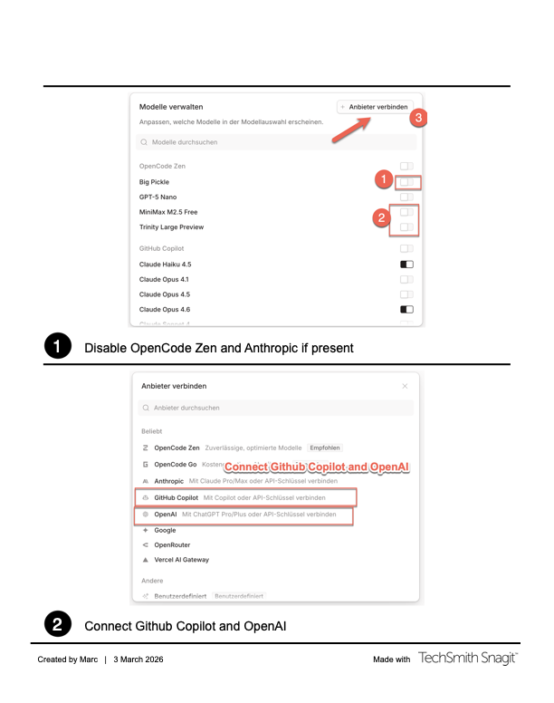

# ai-setup

Provisions a complete AI-assisted development environment on macOS 14+. One command installs and configures [OpenCode](https://opencode.ai), Codex CLI, Copilot CLI, Atlassian MCP, and supporting tooling — then keeps it converged on every rerun.

## I have feedback, how can I provide it?

Please create Github Issues on the project repo for any feedback, bugs, or feature requests. That is the easiest to track it.
You can also visit the public #ai-coding channel on Slack.

## Install

```bash
git clone <this-repo> && cd airconsole-ai-setup
./bootstrap.zsh
```

Bootstrap is idempotent. Rerun anytime to get the latest updates and ensure everything is healthy.

### Updating

```bash
./bootstrap.zsh
ai-setup-doctor             # verify everything is healthy
```

### What Bootstrap Does

Bootstrap sets up OpenCode and its dependencies in phases. Each phase is designed to be idempotent and safe to rerun, ensuring that you can keep your AI development environment up-to-date and functional with minimal effort.

## Configuring Atlassian and Providers

1. Run `opencode-atlassian-login` to authenticate with Atlassian MCP.
2. Launch OpenCode and connect the providers:
   

## Launch OpenCode

```bash
# Terminal UI
opencode

# Web UI (browser-based)
opencode web --port 4096
```

## AI Workflow

See **[ai-guide.md](ai-guide.md)** for the full workflow guide — covers the human-first loop (planning focused), the AI-first loop (agent orchestration), and the command cheat sheet with detailed information on command options per step.

The different agents present are documented in [Agents README](./opencode/agents/README.md)

For onboarding-first walkthroughs:
- **[human-centric-onboarding.md](human-centric-onboarding.md)** — guided path with explicit human checkpoints.
- **[ai-centric-onboarding.md](ai-centric-onboarding.md)** — guided path optimized for AI-led planning and parallel execution.

## CLIs

All tools are installed to `~/.local/bin/` via bootstrap.

| Command                     | Purpose                            |
| --------------------------- | ---------------------------------- |
| `ai-setup-doctor`           | Health check for all integrations  |
| `ai-setup-skill-inventory`  | List/validate installed skills     |
| `opencode-atlassian-login`  | (Re)authenticate Atlassian MCP     |
| `opencode-atlassian-status` | Check Atlassian credential state   |
| `opencode-atlassian-logout` | Clear stored Atlassian credentials |

## Health Check

```bash
ai-setup-doctor        # human-readable
ai-setup-doctor --json # machine-readable
```

If something fails:

| Problem                       | Fix                                                                          |
| ----------------------------- | ---------------------------------------------------------------------------- |
| Codex not authenticated       | Follow the steps above to connect providers and connect OpenAI again         |
| Copilot not configured        | Follow the steps above to connect providers and connect Github Copilot again |
| Atlassian credentials invalid | `opencode-atlassian-login`                                                   |
| General drift                 | `./bootstrap.zsh`                                                             |

## Credentials

Credentials are **never** stored in this repo. Atlassian login stores it securely in the macOS keychain.

## Repo Layout

```bash
bootstrap.zsh            Entry point (delegates to scripts/bootstrap.zsh)
scripts/
bin/                     User-facing CLIs (13 scripts)
opencode/
Brewfile                 Homebrew dependencies (git, gh)
```
