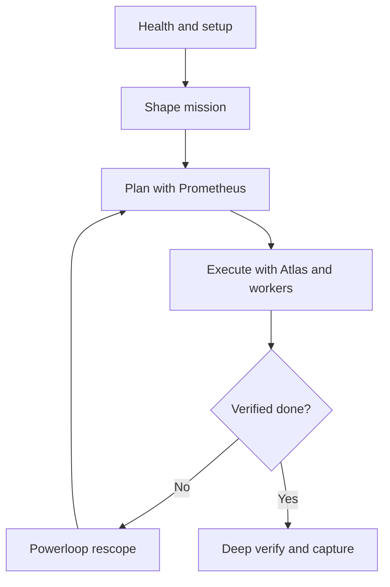

# AI-Centric Onboarding Workflow

Practical day-1 path for users who want AI agents to handle planning and execution while they steer outcomes.

## Outcome

By the end of this onboarding flow, a new user should be able to:
- turn a rough request into an executable agent plan;
- run parallel execution waves safely;
- close with verified output and captured knowledge.

## When to Choose This Path

Use this workflow when:
- the task can be split into atomic work items;
- speed from parallel execution matters;
- you are comfortable delegating implementation details to agents.

If the area is fragile and requires tight human checkpoints, use [human-centric-onboarding.md](human-centric-onboarding.md).

## Agent Selection for This Workflow

Use these role boundaries to keep delegation fast and predictable.

### Sisyphus (Claude Sonnet / Opus Thinking-Based)

Primary role: session lead, framing, routing, and re-scoping.

Use Sisyphus when:
- goals are still ambiguous or contain conflicting constraints;
- you need a strong mission brief before execution starts;
- execution findings require plan changes or re-prioritization;
- you need cross-cutting tradeoff decisions (risk, scope, timing, quality).

Use **Claude Sonnet** mode for:
- fast triage, routine planning, and standard execution routing;
- short feedback loops where speed matters more than deep strategic reasoning.

Use **Claude Opus thinking-based** mode for:
- complex architecture choices with long-term consequences;
- high-ambiguity tasks where assumptions must be challenged explicitly;
- recovery planning when multiple execution waves failed or conflicted.

Expected output from Sisyphus before handoff:
- clear atomic tasks;
- acceptance criteria per task;
- boundaries (paths/systems in and out of scope);
- stop conditions and verification expectations.

### Hephaestus (`gpt-5.30-codex`)

Primary role: implementation specialist for atomic coding tasks.

Use Hephaestus when:
- task scope is concrete and implementation-ready;
- acceptance criteria and touched areas are explicit;
- you want precise execution plus local verification.

Best use cases:
- coding, refactoring, tests, and script updates;
- focused bug fixes with known reproduction;
- running command-level validation and tightening failing checks.

Do not start with Hephaestus when:
- problem framing is unclear;
- tradeoff decisions are unresolved;
- task decomposition is still unstable.

Preferred handoff into Hephaestus:
- objective and constraints in 3-5 bullets;
- exact files or subsystems to touch;
- verification commands and done criteria.

### Quick Routing Rule

- Start with **Sisyphus** for framing, planning, and re-scoping.
- Use **Hephaestus** for atomic implementation and validation.
- If execution reveals new constraints, return to **Sisyphus** and powerloop.

## Workflow At a Glance



## Step 0: Confirm Environment Health (5 min)

```bash
./bootstrap.zsh
ai-setup-doctor --json
```

If Atlassian is in scope:

```bash
opencode-atlassian-status
```

Exit gate: environment is healthy and ready for multi-agent execution.

## Step 1: Shape a Strong Mission Brief (10 min)

Start with one clear business or technical objective:

```bash
/create-actionable-task <ISSUE_KEY|file|description>
```

Only add RCA when failure mechanism is unknown:

```bash
/root-cause-analysis <ISSUE_KEY>
```

Exit gate: the task has explicit success criteria, constraints, and scope boundaries.

## Step 2: Build a Delegation-Ready Plan (10-15 min)

Use Sisyphus to route planning to Prometheus:
- clarify assumptions by interview;
- research codebase context;
- produce an executable plan in `.sisyphus/plans/`.

If GSD state already exists, treat `.planning/` as the lifecycle authority and write `.sisyphus/plans/` as the OmO execution projection of that state.

Optional bridge to GSD canonical planning:

```bash
/gsd-plan-phase <N>
```

Exit gate: plan exists as a durable artifact in `.sisyphus/plans/`, traces back to the upstream task/context, is decomposed into atomic tasks that can run in parallel, and has passed separate critic review before execution starts.

## Step 3: Run Parallel Execution Waves (15-40 min)

Start Atlas orchestration:

```bash
/start-work
```

Atlas delegates to workers (for example Hephaestus), then hands results to a separate verify surface between waves instead of self-approving execution.

Exit gate: each wave produces integrated, testable progress with no unresolved merge conflicts, and the execution stage is ready for `/do:verify` and/or `/gsd-verify-work`.

## Step 4: Use the Powerloop for Constraints (10-20 min)

When execution uncovers constraints:
- feed discoveries back into Prometheus;
- update plan scope and ordering;
- rerun `/start-work` for the next wave.

For user-facing proof and consistency with team process:

```bash
/gsd-verify-work <N>
```

Exit gate: no open blockers, no unplanned side effects, verification status is clear.

## Step 5: Final Proof and Knowledge Capture (10 min)

After implementation is stable and behavior is green:

```bash
/do:verify
/do:review
/do:compound
```

If review returns required changes, run another execution wave and re-verify. `/do:verify` is the deterministic judge; `/do:review` is the deeper critic pass after `/do:verify` is green.

Exit gate: output is production-ready and learnings are preserved for future tasks.

## Guardrails for AI-First Success

- Keep tasks atomic so workers can execute in parallel safely.
- Require explicit success criteria before `/start-work`.
- Do not skip final `do:verify`; parallel speed is useful only when outcomes are reliable.
- Preserve one authoritative plan at a time to avoid orchestration drift.

## Next Step

Use this workflow for broad tasks, then switch to [human-centric-onboarding.md](human-centric-onboarding.md) whenever risk or ambiguity demands closer manual control.
