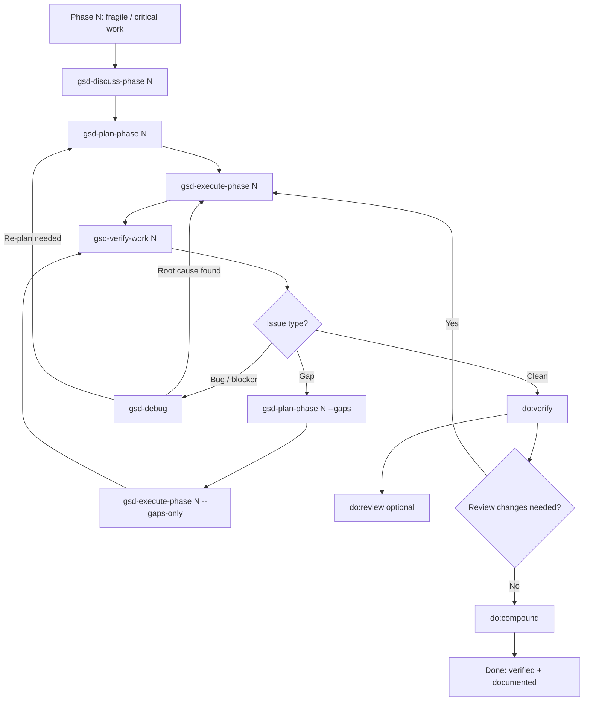
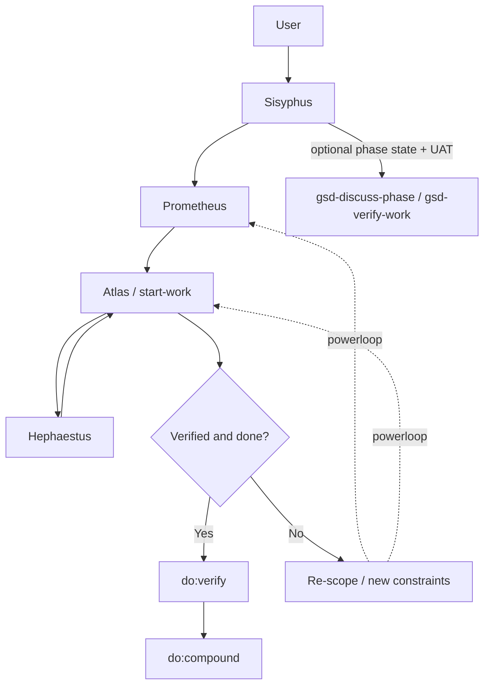
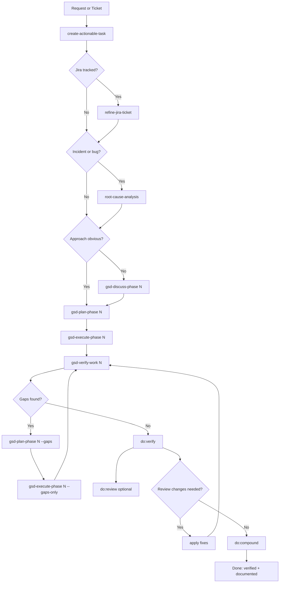

# AI Development Guide

Command-first reference for moving from idea to verified delivery.

---

## The Two Loops

### Human-First Loop

Use when work is in a critical or fragile area. Decisions are captured early, planning is the single source of truth, and verification repeats until green.

Key rules:

- `/gsd-plan-phase` is the single plan authority — no dual-planning.
- Run `/gsd-verify-work` until everything passes before you do `/do:verify`.
- If `/do:verify` or `/do:review` drives changes, re-run `/gsd-verify-work` and `/do:verify`.
- Use `/gsd-debug <description>` for bugs or blockers (not gaps). `/gsd-debug` persists state to `.planning/debug/`.

The detailed workflow guide is in **[human-centric-onboarding.md](human-centric-onboarding.md)**.

---

### AI-First Loop

Use when you delegate more decisions to the AI. OmO agents handle planning and execution in parallel waves, then hand results to separate verification surfaces.

- **Sisyphus** — main interface; holds context, routes work, drives session to completion.
- **Prometheus** — plans via interview + repo research; writes to `.sisyphus/plans/`.
- **Atlas** — executes via `/start-work`; delegates atomic tasks to workers in parallel waves, then hands results to a separate verify surface.
- **Hephaestus** — implements one atomic task at a time with fresh context.

Powerloop: when execution discovers new constraints, feed them back into Prometheus and re-run the next wave on the updated plan.

The detailed workflow guide is in **[ai-centric-onboarding.md](ai-centric-onboarding.md)**.

---

## Shared Reliability Contract

These rules apply whether GSD commands or OmO agents are driving the work.

- **Durable state**: `.planning/` holds GSD lifecycle state, `.sisyphus/plans/` holds OmO execution plans, and `.state/` holds machine-local completion markers.
- **Single plan authority**: if GSD planning exists, `.planning/*` owns lifecycle scope; `.sisyphus/plans/*` is only the OmO execution projection.
- **Stage gates**: do not advance from plan to execute without a plan artifact, from execute to verify without a separate verify pass, or from verify to capture without PASS.
- **Separate judge**: Prometheus and `/gsd-plan-phase` plans are critiqued by Momus or Oracle before execution; Atlas/Hephaestus and `/gsd-execute-phase` outputs are judged by `/gsd-verify-work` and `/do:verify`, with `/do:review` as an optional deeper pass on a green diff.

---

## The Five Stages

Both loops share the same shape: **Shape → Plan → Do → Prove → Capture**

### Shape

Convert raw input into an actionable brief.

| Command | When |
|---|---|
| `/create-actionable-task <ISSUE_KEY\|file\|description>` | Always — normalize the input |
| `/refine-jira-ticket <ISSUE_KEY>` | If Jira-tracked |
| `/root-cause-analysis <ISSUE_KEY>` | If bug / incident / unclear failure mechanism |

Exit gate: another engineer can start implementation without a clarification round-trip.

---

### Plan

Produce a single executable plan with verification hooks.

| Command | When |
|---|---|
| `/gsd-discuss-phase <N>` | Optional — only if multiple valid approaches |
| `/gsd-plan-phase <N>` | Always — canonical executable plan |

Exit gate: plan includes what to build, how to verify, stop conditions, and has a single source of truth.

---

### Do

Implement in focused steps.

| Command | When |
|---|---|
| `/gsd-execute-phase <N>` | Primary execution |
| `/gsd-plan-phase <N> --gaps` | After gaps found in verification |
| `/gsd-execute-phase <N> --gaps-only` | After gap plan is ready |

---

### Prove

Verify with explicit outcomes. Repeat until green.

| Command | When |
|---|---|
| `/gsd-verify-work <N>` | After every execution pass |

Exit gate: verification passes against expected behavior from earlier stages.

---

### Capture

Run deterministic verification first, then optional deeper review, then lock in reusable learnings.

| Command        | What it does                                                                                                                                                                                   |
|----------------|------------------------------------------------------------------------------------------------------------------------------------------------------------------------------------------------|
| `/do:verify`   | Deep multi-agent verification using the different present quality gates on this and all sub git repositories (git submodule, physical folders or symlink) on an already-correct implementation |
| `/do:review`   | Optional deeper multi-agent code review after deterministic verification is already green                                                                                                         |
| `/do:compound` | Captures reusable solution patterns into `knowledge/ai/solutions/`                                                                                                                             |

Rules:
- Run `/do:verify` after `/gsd-verify-work` is green.
- Run `/do:review` only after `/do:verify` passes.
- If `/do:review` drives code changes, re-run `/gsd-verify-work` and `/do:verify` before `/do:compound`.
- `/do:compound` is not optional for complex or recurring fixes.

---

## End-to-End Flow

---

## Quick Anti-Patterns

- Do not start coding from vague input — shape first.
- Do not skip verification because implementation "looks right".
- Do not treat `/do:compound` as optional for complex or recurring fixes.
- Do not plan twice — `gsd-plan-phase` is the single authority.

---

## Verification vs Review

- **Before committing**: Run `/do:verify` to catch issues before they enter history
- **Goal-backward check**: Run `/do:verify --goal-artifact <ticket-or-task.md>` to block completion when artifact acceptance checklist is incomplete
- **Before merging**: Run `/do:verify` | `/do:verify origin/master` to verify against the merge target (`origin/main` is default)
- **In PR review**: Complements `/do:review` — verify runs gates, review runs code review agents
- **After refactoring**: Run `/do:verify` to ensure no regressions

---

## Cheat Sheet

### Shaping

`/create-actionable-task <ISSUE_KEY|file|description>` — Process unrefined input into an actionable output for usage in tasks or AI planning.

### Planning

`/gsd-discuss-phase <N>` — optional discussion when multiple approaches are valid
`/gsd-plan-phase <N>` — canonical plan (single source of truth)

### Execution

`/gsd-execute-phase <N>`          - Execute a plan previously created /gsd-plan-phase <N>
`/start-work`                     - Execute a plan previously created by Prometheus or by mentioning the plan file

### Verification + gap loop

`/gsd-verify-work <N>` — verify the work done in phase N against the expected behavior defined in the plan. If gaps are found, run:
`/gsd-plan-phase <N> --gaps` — produce a plan to close the gaps, then:
`/gsd-execute-phase <N> --gaps-only` — execute only the gap-closing plan. After execution, re-run `/gsd-verify-work <N>`.

### Debugging (bugs/blockers, not gaps)

`/gsd-debug <description>` — creates a debug session with the description, persists state to `.planning/debug/`, and routes to Hephaestus for investigation.

### One shot planning and execution

`/gsd-quick` — produces and executes a plan in one command, without the option for a discussion phase. Use only when the problem is well-scoped and the approach is obvious.

### Review + capture

`/do:verify`                      - gate-based verification (syntax, behavior, safety skills) in this and all sub git repositories (git submodules or symlink!)
`/do:verify --goal-artifact <path>` - includes deterministic goal-backward checklist gate against ticket/task markdown artifact
  `/do:verify origin/master` to verify against the merge target that's not `main` (default)
`/do:review`                      - optional deeper multi-agent review after `/do:verify` is green
`/do:compound`                    - durable knowledge capture (solutions + AGENTS.md)

### Responding to review feedback

`/resolve_pr_parallel`           # parallel PR comment resolution via Atlas
