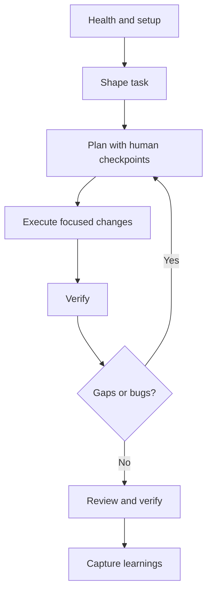

# Human-Centric Onboarding Workflow

Practical day-1 path for engineers who want tight control over decisions while still using AI as leverage.

## Outcome

By the end of this onboarding flow, a new user should be able to:
- take one real task from vague input to clear implementation;
- run a full verify loop without guesswork;
- finish with reusable knowledge captured for the next engineer.

## When to Choose This Path

Use this workflow when:
- the area is fragile, critical, or high-risk;
- you need explicit human checkpoints before coding;
- you want planning artifacts to be the single source of truth.

If your task is broad and parallelizable, use [ai-centric-onboarding.md](ai-centric-onboarding.md) instead.

## Workflow At a Glance



## Step 0: Confirm Environment Health (5 min)

```bash
./bootstrap.zsh
ai-setup-doctor --json
```

If Atlassian is part of your flow:

```bash
opencode-atlassian-status
```

Exit gate: setup is healthy and you can run core commands without errors.

## Step 1: Shape the Work (10-15 min)

Normalize the request into an implementable task:

```bash
/create-actionable-task <ISSUE_KEY|file|description>
```

If the task is Jira-tracked or bug-oriented:

```bash
/refine-jira-ticket <ISSUE_KEY>
/root-cause-analysis <ISSUE_KEY>
```

Exit gate: another engineer could start coding from the shaped output without clarification.

## Step 2: Human-Led Plan (10 min)

Use discussion only if multiple approaches are valid:

```bash
/gsd-discuss-phase <N>
/gsd-plan-phase <N>
```

Treat `/gsd-plan-phase` as canonical. Avoid side plans in chat notes.

If OmO will execute the work later, keep `.planning/*` as the lifecycle authority and treat any `.sisyphus/plans/*` file as a derived execution artifact, not a second plan authority.

Exit gate: plan includes scope, constraints, verification method, stop conditions, and any required separate critic approval before execution.

## Step 3: Execute One Intentional Pass (15-30 min)

```bash
/gsd-execute-phase <N>
```

For blockers (not simple scope gaps):

```bash
/gsd-debug <description>
```

Exit gate: implementation matches the plan and compiles/runs locally.

## Step 4: Verify Until Green (10-20 min)

```bash
/gsd-verify-work <N>
```

If verification finds gaps:

```bash
/gsd-plan-phase <N> --gaps
/gsd-execute-phase <N> --gaps-only
/gsd-verify-work <N>
```

Exit gate: verification is green on expected behavior and the execution result is ready for separate deterministic judging.

## Step 5: Final Quality and Knowledge Capture (10 min)

Run deep checks only after green verification:

```bash
/do:verify
/do:review
/do:compound
```

If review or verify requires code changes, return to Step 4. `/do:verify` is the deterministic judge after execution; `/do:review` is the optional deeper critic pass after `/do:verify` is green.

Exit gate: change is validated and reusable learnings are captured.

## First-Week Habit Loop

- Start every task with `shape -> plan`, not immediate coding.
- Keep one active phase number per task.
- Never skip `gsd-verify-work` because the diff "looks right."
- Capture patterns with `do:compound` for repeatable wins.

## Next Step

After 2-3 tasks on this path, adopt [ai-centric-onboarding.md](ai-centric-onboarding.md) for broader delegation while keeping this verify discipline.
