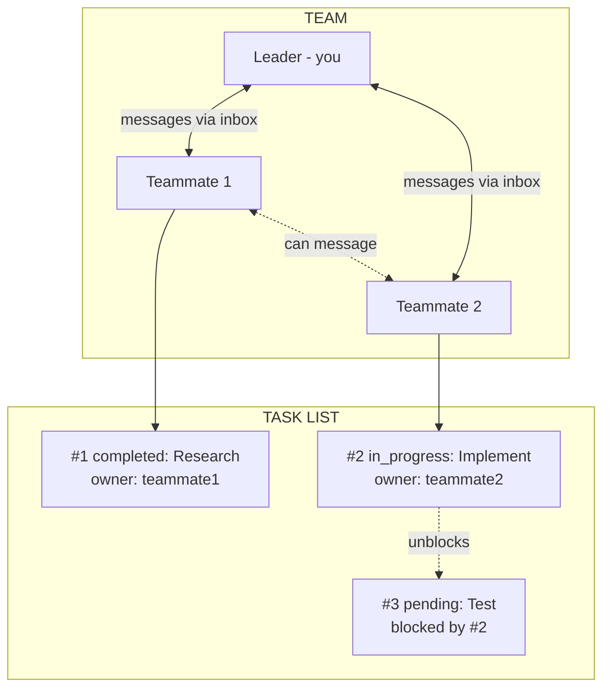

# Claude Code Swarm Orchestration

Master multi-agent orchestration using OpenCode's `task()` API or Claude Code's TeammateTool and Agent system.

> **Environment note:** This skill covers two orchestration systems. Use the [OpenCode task() API](#opencode-task-api) section if you are in an OpenCode environment. The TeammateTool/Agent system below is Claude Code-specific.

---

## OpenCode task() API

OpenCode provides a native `task()` function (internally `call_omo_agent`) for spawning subagents. This is the primary dispatch mechanism in OpenCode environments — it replaces Claude Code's TeammateTool/Agent system entirely.

### Parameters

| Parameter | Type | Required | Description |
|-----------|------|----------|-------------|
| `subagent_type` | string | Yes | Agent type to spawn. Must match a named agent, router, or category in `oh-my-opencode.json`. Examples: `"explore"`, `"librarian"`, `"oracle"`, `"code-review-router"` |
| `prompt` | string | Yes | The task instructions sent to the subagent |
| `description` | string | Yes | Short description (5-10 words) for tracking |
| `run_in_background` | boolean | Yes | `true` = async (returns task_id), `false` = sync (blocks until complete) |
| `category` | string | No | Category from `oh-my-opencode.json`: `quick`, `deep`, `visual-engineering`, `ultrabrain`, `artistry`, `writing`, `unspecified-low`, `unspecified-high` |
| `load_skills` | string[] | No | Skills to load into the subagent's context. Example: `["pre-merge-shell-checklist"]` |
| `session_id` | string | No | Continue a previous agent session with full context |

### Basic Usage

```javascript
// Synchronous — blocks until result is returned
task(
  subagent_type="explore",
  prompt="Find all authentication-related files in this codebase",
  description="Find auth files",
  run_in_background=false
)

// Asynchronous — returns immediately with task_id
task(
  subagent_type="code-review-router",
  prompt="Review this TypeScript PR for type safety",
  description="TS type safety review",
  run_in_background=true
)
```

### Parallel Dispatch Pattern

Fire multiple background tasks simultaneously, then collect results:

```javascript
// Fire all reviews in parallel
task(
  subagent_type="security-router",
  prompt="OWASP compliance review for auth module",
  description="Security review",
  run_in_background=true
)
task(
  subagent_type="code-review-router",
  prompt="Review TypeScript code quality",
  description="Code quality review",
  run_in_background=true
)
task(
  subagent_type="performance-router",
  prompt="Analyze performance characteristics",
  description="Performance review",
  run_in_background=true
)
// System notifies when each completes — use background_output to collect results
```

### Loading Skills into Subagents

Use `load_skills` to inject specific skill knowledge into a subagent:

```javascript
task(
  category="quick",
  load_skills=["pre-merge-shell-checklist"],
  run_in_background=true,
  description="Deep safety: shell checklist",
  prompt="Run the pre-merge-shell-checklist skill against these changed files: scripts/bootstrap.zsh, bin/ai-setup-doctor"
)
```

### Sequential Pipeline Pattern

For dependent tasks, run synchronously or chain results:

```javascript
// Step 1: Research (sync — need result before continuing)
task(
  subagent_type="explore",
  prompt="Find all files that import from auth/ module",
  description="Find auth dependencies",
  run_in_background=false
)

// Step 2: Use research results to dispatch implementation
task(
  subagent_type="oracle",
  prompt="Based on the auth module structure found, design the refactoring plan",
  description="Design auth refactor",
  run_in_background=false
)
```

### Agent Types Available

| Type | Use Case |
|------|----------|
| `explore` | Quick codebase scans, file discovery |
| `librarian` | Deep documentation/code search, cross-referencing |
| `oracle` | Architectural questions, root-cause analysis |
| `hephaestus` | Multi-file implementation, cross-domain work |
| `metis` | Planning and strategic analysis |
| `momus` | Critical review and feedback |
| `multimodal-looker` | Visual/image analysis |
| `{router}-router` | 12 specialist routers — see `opencode/agents/README.md` |
| `mobile-architect` | iOS/Android/cross-platform mobile development (Swift, Kotlin, React Native, Flutter) |

### Key Differences from Claude Code TeammateTool

| Aspect | OpenCode `task()` | Claude Code TeammateTool |
|--------|-------------------|--------------------------|
| Dispatch | `task(subagent_type=..., prompt=...)` | `Agent({ team_name, name, subagent_type, prompt })` |
| Parallelism | Multiple `task(run_in_background=true)` | `Agent({ run_in_background: true })` per teammate |
| Team management | Not needed — agents are stateless | `Teammate({ operation: "spawnTeam" })` etc. |
| Task tracking | `background_output(task_id)` | `TaskCreate/TaskUpdate/TaskList` |
| Skill injection | `load_skills=["skill-name"]` | Not available |
| Session continuity | `session_id` parameter | Inbox/message system |

## Quick Decision Guide (Claude Code)

See the decision tree in [Decision Tree](#agent-selection-decision-tree).

## Primitives and Core Concepts

| Primitive | What It Is | File Location |
|-----------|-----------|---------------|
| **Agent** | A Claude instance that can use tools. You are an agent. Subagents are agents you spawn. | N/A (process) |
| **Team** | A named group of agents working together. One leader, multiple teammates. | `~/.claude/teams/{name}/config.json` |
| **Teammate** | An agent that joined a team. Has a name, color, inbox. Spawned via Agent with `team_name` + `name`. | Listed in team config |
| **Leader** | The agent that created the team. Receives teammate messages, approves plans/shutdowns. | First member in config |
| **Task** | A work item with subject, description, status, owner, and dependencies. | `~/.claude/tasks/{team}/N.json` |
| **Inbox** | JSON file where an agent receives messages from teammates. | `~/.claude/teams/{name}/inboxes/{agent}.json` |
| **Message** | A JSON object sent between agents. Can be text or structured (shutdown_request, idle_notification, etc). | Stored in inbox files |
| **Backend** | How teammates run. Auto-detected: `in-process` (same Node.js, invisible), `tmux` (separate panes, visible), `iterm2` (split panes in iTerm2). See [Spawn Backends](#spawn-backends). | Auto-detected based on environment |

### How They Connect



### File Structure

```
~/.claude/teams/{team-name}/
├── config.json              # Team metadata and member list
└── inboxes/
    ├── team-lead.json       # Leader's inbox
    ├── worker-1.json        # Worker 1's inbox
    └── worker-2.json        # Worker 2's inbox

~/.claude/tasks/{team-name}/
├── 1.json                   # Task #1
├── 2.json                   # Task #2
└── 3.json                   # Task #3
```

### Team Config Structure

Team config lives at `~/.claude/teams/{name}/config.json`. Key fields: `name`, `description`, `leadAgentId`, `members[]` (name, agentType, backendType, model, prompt, planModeRequired).

## Agent Selection Decision Tree

Route every task through these 5 axes **in order**. Stop at the first axis that produces a terminal action (research gate or safety override). Otherwise, continue to the next axis.

```
Axis 1 — CONFIDENCE (gate: execute vs research)
├─ Count task signals: file paths, error msgs, line numbers, acceptance criteria, code snippets, named symbols
├─ Score 5-6 (high) → proceed to Axis 2
├─ Score 3-4 (medium) → proceed to Axis 2 (executor will read related files first)
└─ Score 0-2 (low) → RESEARCH FIRST, do not execute
   ├─ Quick scan needed        → subagent_type="explore", then re-triage
   ├─ Deep search needed       → subagent_type="librarian", then re-triage
   ├─ Architectural question   → subagent_type="oracle", then re-triage
   └─ Low + irreversible risk  → ESCALATE to user (never auto-research)

Axis 2 — RISK LEVEL (override: safety gates)
├─ read_only (no file modifications)  → skip safety gates, proceed to Axis 3
├─ reversible (git-tracked changes)   → snapshot recommended if >5 files, proceed to Axis 3
└─ irreversible (DB migration, Keychain, production deploy, force-push)
   ├─ Pre-check: load_skills=["deployment-verification-agent"] or ["security-sentinel"]
   ├─ MANDATORY: ai-setup-snapshot --create + user confirmation
   └─ Override: minimum category="deep" (never "quick"), then proceed to Axis 3

Axis 3 — TASK INTENT (select agent role — first verb wins)
├─ create/build/add/implement/refactor/update → generate  → proceed to Axis 4
├─ review/audit/check/verify/validate         → review    → proceed to Axis 4
├─ find/research/explore/investigate           → explore   → category="quick" (STOP)
├─ document/write-docs/describe/explain        → document  → category="writing" (STOP)
└─ fix/debug/diagnose/resolve/troubleshoot     → debug
   ├─ Root cause known (file + line given)    → proceed to Axis 4
   └─ Root cause unknown                      → subagent_type="oracle", then re-triage

Axis 4 — ARTIFACT TYPE (refine category — first match wins: extension → directory → keyword)
├─ frontend_ui (.tsx/.jsx/.css/.vue, UI/design keywords)
│  ├─ generate/review intent                  → category="visual-engineering"
│  └─ creative/visual generation keywords     → category="artistry"
├─ backend_logic (.ts/.js/.py/.go, API/service keywords)
│  ├─ Architectural scope (design/trade-off)  → category="ultrabrain"
│  ├─ Multi-file (>3 files estimated)         → category="deep"
│  └─ Single-file scope                       → category="quick"
├─ shell_infra (.zsh/.sh, Dockerfile, CI .yml, bin/ scripts/)
│  ├─ Complex (>2 files or cross-phase)       → category="deep"
│  └─ Simple edit (1-2 files)                 → category="quick"
├─ docs_config (.md/.txt/.json/.yaml/.toml non-CI)
│  ├─ Prose/documentation output              → category="writing"
│  └─ Config/simple edit                      → category="quick"
├─ tests (.test.*/.spec.*/test_*)
│  ├─ Test infrastructure/framework           → category="deep"
│  └─ Simple test addition                    → category="quick"
├─ mobile (.swift/.kt/.dart, iOS/Android/React Native/Flutter/Capacitor/Ionic keywords)
│  └─ any intent                              → subagent_type="mobile-architect" (STOP)
└─ mixed/unknown (no clear domain signal)
   ├─ High-stakes (auth/security/data/creds)  → category="unspecified-high"
   └─ Low-stakes (everything else)             → category="unspecified-low"

Axis 5 — URGENCY (dispatch mode only — does not change category)
├─ blocking ("urgent"/"ASAP"/"blocker"/critical path) → run_in_background=false
├─ normal (default, no urgency markers)                 → run_in_background=false
└─ background ("low priority"/"when you can"/docs-only) → run_in_background=true
```

**Category Dispatch Matrix** — one row per `oh-my-opencode.json` category:

| Category | Primary Use | Observable Signal | Fallback | Escalate When |
| --- | --- | --- | --- | --- |
| `visual-engineering` | Frontend UI generation and review | `.tsx/.jsx/.css` or UI/design keywords | `artistry` | 2 visual regressions unresolved |
| `ultrabrain` | Architectural decisions, system design | "design"/"trade-off"/"system boundary" keywords | `oracle` agent | Confidence < high on irreversible decision |
| `deep` | Multi-file changes, complex reasoning | >3 files estimated, or schema/auth/prod change | `unspecified-high` | Syntax gate fails 2× on same file |
| `artistry` | Creative/visual asset generation | "illustration"/"creative"/"visual asset" keywords | `visual-engineering` | Production-facing visual regression |
| `quick` | Explore intent, single-file edits | First verb is find/research, or 1-file scope | `explore` agent | Task discovered to need >3 files |
| `unspecified-low` | Low-stakes mixed-domain work | No domain signal, single-file, no auth/security | `quick` | Scope expands beyond initial estimate |
| `unspecified-high` | High-stakes mixed-domain work | "credentials"/"auth"/"secret"/"database" in task | `deep` | 2 consecutive task failures |
| `writing` | Documentation and prose | First verb is document/write-docs, or `.md` output | `librarian` agent | Output contradicts source-of-truth |

**Named Agent Gates** (exceptional — used as `subagent_type`, not as category):

- **`explore`** — Axis 1: low confidence + quick codebase scan needed
- **`librarian`** — Axis 1: low confidence + deep documentation/code search needed
- **`oracle`** — Axis 1: low confidence + architectural question; OR Axis 3: debug + root cause unknown
- **`deployment-verification-agent`** / **`security-sentinel`** (via `load_skills`) — Axis 2: irreversible risk pre-check before execution
- **`mobile-architect`** — Axis 4: mobile artifact type (`.swift`, `.kt`, `.dart`, iOS/Android/React Native/Flutter keywords) → dispatch directly, do not route through category


## Fallback & Escalation

### Domain Fallback Chains

Every domain path follows a 3-level fallback chain: **Primary → Secondary → Escalate**. Never deeper.

Fallback rules:
- Secondary must differ meaningfully from primary (different model family OR capability)
- Only 3 escalation actions exist: **PAUSE**, **ABORT**, **DECOMPOSE**
- "Safe default" fallback applies when no domain matches (see below)

**Domain 1 — Frontend / UI**
Signal: CSS, HTML, components, styling, animations, responsive, Figma, Tailwind, Storybook, visual diff
- Primary: `visual-engineering` — task artifact is a UI component, stylesheet, or visual spec
- Secondary: `artistry` — ≥2 unresolved visual regressions OR creative iteration beyond structural code
- escalate: 2 consecutive attempts fail visual diff AND production-facing → escalation via **PAUSE** with diff evidence for human design review

**Domain 2 — Backend / Infra / Shell**
Signal: scripts, APIs, config, zsh/bash, Node.js, Python backend, CI/CD, Docker, deployment
- Primary: `unspecified-high` — task artifact is shell script, server code, pipeline, or infra definition
- Secondary: `hephaestus` — primary fails syntax/lint OR task requires coordinated changes across ≥3 files
- escalate: syntax check (`zsh -n`, `bash -n`, `node --check`) fails 2 consecutive attempts → **ABORT** with error output + suggested decomposition

**Domain 3 — Documentation / Writing**
Signal: docs, README, AGENTS.md, changelog, writing, technical writing, knowledge capture
- Primary: `writing` — primary artifact is prose, documentation, or structured markdown
- Secondary: `librarian` — task requires codebase-aware documentation (must read existing code first)
- escalate: output contradicts source-of-truth files (AGENTS.md/README/rules/) in safety-critical section → **PAUSE** with file:line refs for human review

**Domain 4 — Debugging / Root-Cause Analysis**
Signal: bug, error, stack trace, regression, root cause, bisect, reproduce, failure investigation
- Primary: `oracle` — task requires deep reasoning about failure modes or behavioral analysis
- Secondary: `deep` — oracle's analysis is inconclusive OR task requires code-level reproduction steps
- escalate: 2 analysis attempts fail to identify root cause AND reproduction steps unestablished AND bug is user-reported → **PAUSE** with investigation log (hypotheses, evidence, dead ends)

**Domain 5 — Exploration / Research**
Signal: understand, explore, onboard, research, find, investigate codebase, discover patterns
- Primary: `explore` — task is read-only information gathering (no code changes expected)
- Secondary: `librarian` — exploration requires cross-referencing multiple files/docs OR synthesizing a structured report
- escalate: ≥20 files examined without finding target → **PAUSE** with search space report + ask for refined criteria

**Domain 6 — Architecture / Design**
Signal: architecture, design decision, system design, refactor strategy, tech debt, service boundaries, trade-offs
- Primary: `ultrabrain` — task requires evaluating trade-offs, designing interfaces, or making irreversible structural decisions
- Secondary: `oracle` — decision requires cross-cutting analysis across ≥3 system boundaries OR unfamiliar domain
- escalate: decision is irreversible (schema/API/auth) AND confidence < high AND no precedent in knowledge/ai/ → **PAUSE** with options matrix (≥2 alternatives with pros/cons/risks) requiring human approval

**Domain 7 — Cross-Domain / Mixed**
Signal: task spans multiple domains OR cannot be cleanly classified into a single domain
- Primary: `hephaestus` — task explicitly requires changes across ≥2 domain boundaries
- Secondary: `unspecified-high` — hephaestus output covers some domains but misses others OR inter-domain integration is broken
- escalate: task touches ≥3 domains AND at least one is architecture/security → **DECOMPOSE** into per-domain subtasks with dependency ordering

**Domain 8 — Mobile Development**
Signal: Swift, Kotlin, Dart, Flutter, React Native, iOS, Android, SwiftUI, Jetpack Compose, Capacitor, Ionic, app store, push notifications, deep linking, biometric
- Primary: `mobile-architect` — task artifact is a native or cross-platform mobile component, screen, or mobile-specific config
- Secondary: `deep` — mobile-architect output is incomplete OR task requires coordinated changes across ≥3 platform targets (iOS + Android + backend)
- escalate: task involves app store submission, platform policy compliance (Apple Review Guidelines, Google Play Policy), or production crash reporting → **PAUSE** with platform-specific evidence for human review

### Safe Default Rule

When **no domain signal** matches the task, classify by scope:

| Tier | Condition | Assignment |
|------|-----------|------------|
| 1 | Read-only (no mutations) | `explore` (category=`quick`) |
| 2 | Mutating, scope ≤1 file | `unspecified-low` |
| 3 | Mutating, scope 2–5 files | `unspecified-high` |
| 4 | Mutating, scope >5 files OR involves auth/credentials/security | **ESCALATE** immediately to orchestrator |

### Escalation Trigger Table

All triggers are measurable — no vague "escalate when appropriate" conditions. Each escalation trigger maps to exactly one action.

| # | Condition | Threshold | Action |
|---|-----------|-----------|--------|
| 1 | Consecutive subagent failures on same task | ≥2 attempts | **ABORT** → return to orchestrator with failure artifacts + decomposition suggestion |
| 2 | Syntax/lint gate failure after retry | ≥2 consecutive on generated code | **ABORT** → log error output + file list → return for alternate agent |
| 3 | Irreversible change + low confidence | confidence < high AND schema/API/auth change | **PAUSE** → present options matrix (≥2 alternatives) → require human approval |
| 4 | Visual diff regression in production UI | ≥2 unresolved regressions after retry | **PAUSE** → request human design review with diff evidence |
| 5 | Root cause not identified | ≥2 analysis attempts with no root cause | **PAUSE** → compile investigation log → request domain expert |
| 6 | Exploration exhaustion | ≥20 files examined, target not found | **PAUSE** → report search space → ask for refined criteria |
| 7 | Source-of-truth contradiction | output conflicts with AGENTS.md/README/rules/ in safety-critical section | **PAUSE** → flag with file:line refs → human review |
| 8 | Unknown artifact type + high risk | artifact type not in known list AND task is mutating | **ESCALATE** immediately — do not attempt |
| 9 | Cross-domain high-risk overlap | ≥3 domains AND includes architecture/security | **DECOMPOSE** → per-domain subtasks with dependency ordering |
| 10 | Task scope explosion | initial 1-file task discovered to require >5 files | **PAUSE** → re-scope with orchestrator before continuing |

### Uncertainty Handling Policy

Claims in this skill are tagged with verification status. Conservative-by-default: if an `[unverified]` claim affects a safety decision (timeout, escalation threshold, permission), use the **more conservative** interpretation.

**Verified claims** (confirmed against source code or runtime behavior):

- [verified] Model resolution falls through to error on unknown `type` value — confirmed via SKILL.md error handling flowchart. If you pass an invalid category, the spawn fails explicitly rather than silently defaulting.
- [verified] Backend auto-detection fallback chain ends at error node — confirmed via SKILL.md spawn backends (4 backends: in-process → tmux → iterm2 → error). No silent fallback to a working state.
- [verified] Permission inheritance: spawned agents inherit MCP access from the leader — confirmed via opencode.jsonc propagation behavior. No per-agent permission override at spawn time.

**Unverified claims** (documented but not independently confirmed):

- [unverified] 5-minute heartbeat timeout for long-running tasks — documented in best practices but no upstream Claude Code source confirms the exact threshold. **Conservative guidance**: send heartbeat for tasks >3 min (not >5 min) as safe margin.
- [unverified] TeammateIdle hook timeout threshold — the hook exists but the exact timeout value is not officially documented. **Conservative guidance**: treat long-idle agents as potentially timed out rather than assuming they are still running.
- [unverified] "Tested with Claude Code v2.1.19 on 2026-01-25" — version and date not independently confirmable. **Conservative guidance**: re-verify swarm behaviors after Claude Code updates; do not assume version-specific behaviors persist across upgrades.

**Policy rules:**
1. Runtime behavior trumps documentation — if an [unverified] claim is contradicted by observed behavior, trust the observation and flag the contradiction for escalation.
2. No third tier — labels are strictly [verified] or [unverified]. "Partially verified" is not permitted.
3. All 6 claims trace to task-1-claim-map.txt cross-reference audit — no claims were invented for this table.


## Anti-Patterns

### AP-1: Wrong Agent Selection (General vs. Specialist Mismatch)

**Bad:**
```js
Agent({ team_name: "codebase-review", name: "reviewer", subagent_type: "general-purpose", prompt: "Review code for security vulnerabilities" })
```

**Good:**
```js
Agent({ team_name: "codebase-review", name: "security-reviewer", subagent_type: "security-sentinel", prompt: "Review for SQL injection, XSS, auth bypass, data exposure" })
```

**Risk:** Generic agents lack domain focus — security issues missed. 57 specialist agents exist in `opencode/agents/` but only work if spelled correctly and matched to their category.

### AP-2: Scope Creep in Single Delegation

**Bad:**
```js
Agent({ team_name: "oauth-flow", name: "mega-worker", subagent_type: "general-purpose", prompt: "Research OAuth. Design. Code. Test. Deploy. Monitor. Report.", run_in_background: true })
```

**Good:**
```js
Agent({ team_name: "oauth-flow", name: "researcher", subagent_type: "research-router", prompt: "Research OAuth2 providers. Mark task #1 complete.", run_in_background: true })
Agent({ team_name: "oauth-flow", name: "implementer", subagent_type: "general-purpose", prompt: "Implement OAuth2 per research. Mark task #2 complete.", run_in_background: true })
TaskUpdate({ taskId: "2", addBlockedBy: ["1"] })
```

**Risk:** Single overloaded agent hits context limits mid-task — no partial progress saved. Dependencies unmapped, so no auto-progression.

### AP-3: Missing Fallback on Agent Failure

**Bad:**
```js
Agent({ team_name: "review", name: "solo-reviewer", subagent_type: "general-purpose", prompt: "Review all 20 files. Send results when done.", run_in_background: true })
```

**Good:**
```js
TaskCreate({ subject: "Review file A" })
TaskCreate({ subject: "Review file B" })
Agent({ team_name: "review", name: "worker-1", subagent_type: "general-purpose", prompt: "Loop: TaskList unowned, TaskUpdate claim, complete, Teammate write to team-lead, repeat.", run_in_background: true })
```

**Risk:** Agent crashes → task stays assigned, work lost [unverified: crash-task reclaim behavior is undocumented — see also line ~1349]. No automatic reclaim mechanism is confirmed. Leader may never know task stalled. Entire pipeline at risk.

### AP-4: Backend Assumption Mismatch (in-process vs. tmux)

**Bad:**
```js
Agent({ team_name: "research", name: "worker-1", subagent_type: "Explore", prompt: "Search for OAuth libraries. Show me results as you find them.", run_in_background: true })
```

**Good:**
```js
Agent({ team_name: "research", name: "worker-1", subagent_type: "Explore", prompt: "Search OAuth libraries. When done, send results to team-lead via Teammate write.", run_in_background: true })
```

**Risk:** Assuming in-process agents show output → you think they're hung when actually working. Leads to duplicate spawns and invisible over-parallelization.

### AP-5: Alias Confusion (Task vs. Agent Naming)

**Bad:**
```js
Agent({ team_name: "team", name: "lead", subagent_type: "general-purpose", prompt: "Spawn workers with TaskCreate() and create tasks with Agent()." })
```

**Good:**
```js
Agent({ team_name: "team", name: "lead", subagent_type: "general-purpose", prompt: "Spawn teammates with Agent(...). Create work items with TaskCreate(). Claim and complete with TaskUpdate()." })
```

**Risk:** Teammates use wrong tool name → spawn fails with confusing errors. Inconsistent naming spreads through team prompts.

### AP-6: Blocking on Wrong Signal (TeammateIdle vs. Completion)

**Bad:**
```js
Agent({ team_name: "research", name: "worker", subagent_type: "Explore", prompt: "Research topic X and send findings when done.", run_in_background: true })
```

**Good:**
```js
Agent({ team_name: "research", name: "worker", subagent_type: "Explore", prompt: "Research topic X. When complete, Teammate write {type: \"work_complete\"} to team-lead.", run_in_background: true })
```

**Risk:** Leader waits for idle → agent is still working on next task. Pipeline continues prematurely. Results lost because no explicit completion message sent.

### AP-7: Permission Over-Grant (bypassPermissions Propagation)

**Bad:**
```js
Agent({ team_name: "review", name: "aggressive-reviewer", subagent_type: "general-purpose", prompt: "Review code and fix issues directly.", bypassPermissions: true })
```

**Good:**
```js
Agent({ team_name: "review", name: "reviewer", subagent_type: "security-router", permissions: ["read:files", "read:git"], prompt: "Review for security issues. Report findings, do not modify." })
```

**Risk:** `bypassPermissions` propagates to all downstream teammates [unverified: permission inheritance scope is not confirmed in upstream docs]. Scoped permissions may be silently ignored. Compromised or rogue agent may gain elevated access.

### AP-8: Parallelization Conflict (Same File, Concurrent Writes)

**Bad:**
```js
Agent({ team_name: "impl", name: "worker-a", subagent_type: "general-purpose", prompt: "Implement auth logic in app/auth.js", run_in_background: true })
Agent({ team_name: "impl", name: "worker-b", subagent_type: "general-purpose", prompt: "Implement encryption in app/auth.js", run_in_background: true })
```

**Good:**
```js
Agent({ team_name: "impl", name: "auth-worker", subagent_type: "general-purpose", prompt: "Implement auth in app/auth.js. Mark task #1 complete.", run_in_background: true })
Agent({ team_name: "impl", name: "crypto-worker", subagent_type: "general-purpose", prompt: "Implement encryption in app/crypto.js. Mark task #2 complete.", run_in_background: true })
TaskUpdate({ taskId: "2", addBlockedBy: ["1"] })
```

**Risk:** Last write wins — first worker's changes silently lost [unverified: no upstream doc confirms concurrent-write behavior]. No concurrent-write warning from Claude Code is documented. Entire feature at risk.

### AP-9: No Deterministic Routing (Agent Type Typo or Mismatch)

**Bad:**
```js
Agent({ team_name: "feature-x", name: "reviewer", subagent_type: "security-router", prompt: "Review for security issues" })
```

**Good:**
```js
Agent({ team_name: "feature-x", name: "reviewer", subagent_type: "security-sentinel", prompt: "Review for security issues" })
```

**Risk:** Typos cause spawn failures or silent fallback to wrong agent [unverified: silent vs. explicit failure mode is environment-dependent]. Work may be assigned to unqualified agent. Quality degrades with no recovery path.

---

## Spawning Agents (Two Methods)

### Method 1: Agent tool (subagent)

Agent tool (previously called Task tool in v2.1.62 and earlier; Task() still works as an alias).

Use Agent for **short-lived, focused work** that returns a result:

```javascript
Agent({
  subagent_type: "Explore",
  description: "Find auth files",
  prompt: "Find all authentication-related files in this codebase",
  model: "haiku"  // Optional: haiku, sonnet, opus
})
```

**Characteristics:**
- Runs synchronously (blocks until complete) or async with `run_in_background: true`
- Returns result directly to you
- No team membership required
- Best for: searches, analysis, focused research

### Method 2: Agent tool + team_name + name (Teammates)

Use Agent with `team_name` and `name` to **spawn persistent teammates**:

```javascript
// First create a team
Teammate({ operation: "spawnTeam", team_name: "my-project" })

// Then spawn a teammate into that team
Agent({
  team_name: "my-project",        // Required: which team to join
  name: "security-reviewer",      // Required: teammate's name
  subagent_type: "security-router",
  prompt: "Review all authentication code for vulnerabilities. Send findings to team-lead via Teammate write.",
  run_in_background: true         // Teammates usually run in background
})
```

**Characteristics:**
- Joins team, appears in `config.json`
- Communicates via inbox messages
- Can claim tasks from shared task list
- Persists until shutdown
- Best for: parallel work, ongoing collaboration, pipeline stages

### Key Difference

| Aspect | Agent (subagent) | Agent + team_name + name (teammate) |
|--------|-----------------|-----------------------------------|
| Lifespan | Until task complete | Until shutdown requested |
| Communication | Return value | Inbox messages |
| Task access | None | Shared task list |
| Team membership | No | Yes |
| Coordination | One-off | Ongoing |

---


## Team Operations

Core operations. Full operation reference is in Appendix: Configuration Reference.

```javascript
Teammate({ operation: "spawnTeam", team_name: "feature-auth", description: "Implementing OAuth2 authentication" })
Teammate({ operation: "write", target_agent_id: "security-reviewer", value: "Please prioritize the authentication module." })
Teammate({ operation: "requestShutdown", target_agent_id: "security-reviewer", reason: "All tasks complete, wrapping up" })
Teammate({ operation: "cleanup" })
```

---

### Task System Integration

Use tasks as the coordination layer for pipelines and swarms:

- `TaskCreate` defines work items (subject, description, activeForm)
- `TaskUpdate` claims (`owner`), updates status, and models dependencies (`addBlockedBy`)
- `TaskList` and `TaskGet` drive routing and handoffs
- Tasks persist as JSON under `~/.claude/tasks/{team-name}/`

Full API signatures and examples are in Appendix: Message Format API.

---

## Message Formats

Teammates communicate via inbox JSON messages. Messages can be plain text, or structured JSON payloads embedded in the `text` field (shutdown_request, idle_notification, etc).

Full examples are in Appendix: Message Format API.

---

## Orchestration Patterns (Quick Reference)

(See Appendix: Full Workflow Examples for detailed code.)

### Pattern 1: Parallel Specialists (Leader Pattern)

Spawn multiple specialist teammates in parallel, collect results via inbox, then shut down and cleanup.

```javascript
Teammate({ operation: "spawnTeam", team_name: "code-review" })
Agent({ team_name: "code-review", name: "security", subagent_type: "...", prompt: "...", run_in_background: true })
Agent({ team_name: "code-review", name: "performance", subagent_type: "...", prompt: "...", run_in_background: true })
Teammate({ operation: "requestShutdown", target_agent_id: "security" })
Teammate({ operation: "requestShutdown", target_agent_id: "performance" })
Teammate({ operation: "cleanup" })
```

### Pattern 2: Pipeline (Sequential Dependencies)

Create a task pipeline with dependencies, then spawn workers that wait for unblocked tasks.

See Appendix: Full Workflow Examples.

### Pattern 3: Swarm (Self-Organizing)

Workers grab available tasks from a pool and self-organize around unblocked work:

See Appendix: Full Workflow Examples.

---

## Backend & Runtime


### Environment Variables

Spawned teammates automatically receive these:

`CLAUDE_CODE_TEAM_NAME`, `CLAUDE_CODE_AGENT_ID`, `CLAUDE_CODE_AGENT_NAME`, `CLAUDE_CODE_AGENT_TYPE`, `CLAUDE_CODE_AGENT_COLOR`, `CLAUDE_CODE_PLAN_MODE_REQUIRED`, `CLAUDE_CODE_PARENT_SESSION_ID`.

Example values are in Appendix: Backend & Runtime Detailed.

---

### MCP Access for Teammates

Teammates spawned via `Agent()` inherit MCP access from the leader's `opencode.jsonc` configuration [verified]. All MCPs defined in the leader's config (Atlassian, etc.) are available to teammates without additional setup.

> **Note:** If a teammate fails with an MCP-related error, verify the MCP is correctly configured in `opencode.jsonc` and that the leader's session has valid credentials. Teammates cannot acquire MCP permissions that the leader does not already have [verified]. Pre-swarm verification: run `opencode-atlassian-status` before spawning agents that require Atlassian MCP.

---

**Using in prompts:**
```javascript
Agent({
  team_name: "my-project",
  name: "worker",
  subagent_type: "general-purpose",
  prompt: "Your name is $CLAUDE_CODE_AGENT_NAME. Use it when sending messages to team-lead."
})
```

---

### Spawn Backends

A **backend** determines how teammate Claude instances actually run. Claude Code supports three backends, and **auto-detects** the best one based on your environment [verified].

Backends:
- `in-process`: fastest, invisible output
- `tmux`: visible panes, survives leader exit
- `iterm2`: visible panes in iTerm2 (macOS)

Force a backend:
```bash
export CLAUDE_CODE_SPAWN_BACKEND=in-process  # or: tmux
unset CLAUDE_CODE_SPAWN_BACKEND              # auto-detect
```

See Appendix: Backend & Runtime Detailed for comparison, detection logic, and troubleshooting.

---

## Error Handling & Troubleshooting

### Common Errors

| Error | Cause | Solution |
|-------|-------|----------|
| "Cannot cleanup with active members" | Teammates still running | `requestShutdown` all teammates first, wait for approval |
| "Already leading a team" | Team already exists | `cleanup` first, or use different team name |
| "Agent not found" | Wrong teammate name | Check `config.json` for actual names |
| "Team does not exist" | No team created | Call `spawnTeam` first |
| "team_name is required" | Missing team context | Provide `team_name` parameter |
| "Agent type not found" | Invalid subagent_type | Check available agents with proper prefix |

### Model Resolution Order

When you specify `subagent_type`, the model is resolved in this order [verified]:

1. **Named agent** — exact match in `oh-my-opencode.json` agents section (e.g., `"Explore"`, `"general-purpose"`)
2. **Category** — prefix match against category definitions in `oh-my-opencode.json`
3. **Error** — `"Agent type not found"` if neither named nor category match

> **Important:** 57 plugin agents defined in `opencode/agents/` do not automatically have model assignments in `oh-my-opencode.json` [verified]. Only the 10 named agents, 8 category models, and 12 category routers (30 entries total) are mapped. If you use a bare specialist name like `security-sentinel` or `database-wizard`, the task fails at spawn time with `"Agent type not found"`. Use the router pattern instead: `subagent_type: "security-router"` to access all security specialists. Always verify agent type spelling against the lists in [AP-9: Agent Type Typo](#ap-9-no-deterministic-routing-agent-type-typo-or-mismatch).

**Quick check before spawning:**
```bash
# See all defined agent types and categories
cat ~/.config/opencode/oh-my-opencode.json | jq 'keys'
```

### Graceful Shutdown Sequence

**Always follow this sequence [verified]:**

```javascript
// 1. Request shutdown for all teammates
Teammate({ operation: "requestShutdown", target_agent_id: "worker-1" })
Teammate({ operation: "requestShutdown", target_agent_id: "worker-2" })

// 2. Wait for shutdown approvals
// Check for {"type": "shutdown_approved", ...} messages

// 3. Verify no active members
// Read ~/.claude/teams/{team}/config.json

// 4. Only then cleanup
Teammate({ operation: "cleanup" })
```

### Handling Crashed Teammates

Teammates have a 5-minute heartbeat timeout [unverified]. (Conservative: send heartbeat every 2–3 min.) If a teammate crashes:

1. They'll be automatically marked as inactive after timeout [unverified]
2. Their tasks remain in the task list
3. Another teammate can claim their tasks [unverified — crash-task reclaim is undocumented; treat as best-effort, not guaranteed]
4. Cleanup will work after timeout expires

### Debugging

```bash
# Check team config
cat ~/.claude/teams/{team}/config.json | jq '.members[] | {name, agentType, backendType}'

# Check teammate inboxes
cat ~/.claude/teams/{team}/inboxes/{agent}.json | jq '.'

# List all teams
ls ~/.claude/teams/

# Check task states
cat ~/.claude/tasks/{team}/*.json | jq '{id, subject, status, owner, blockedBy}'

# Watch for new messages
tail -f ~/.claude/teams/{team}/inboxes/team-lead.json
```

---


---

## Best Practices

1. Always cleanup after swarm completes — call `Teammate({ operation: "cleanup" })`.
2. Use meaningful names for teams and teammates — aids debugging and heartbeat tracing.
3. Use task dependencies — model sequential work with `blockedBy` in TaskCreate to prevent race conditions.
4. Include heartbeat instructions for long-running teammates — prompt them to update task files every 3 minutes.
5. Persist progress to task files — teammates should write intermediate results so context resets don't lose work.

---


## Appendix / References

### Agent Catalog

Full agent catalog (57 agents, 11 categories) → see `opencode/agents/README.md`.

### Quick Reference

**Spawn subagent (no team):**
```javascript
Agent({ subagent_type: "explore", prompt: "Find all API endpoints" })
```

**Spawn teammate (with team):**
```javascript
Agent({ team_name: "my-team", name: "worker", subagent_type: "deep", prompt: "..." })
```

**Send message to teammate:**
```javascript
Teammate({ operation: "write", target_agent_id: "worker", message: { role: "user", content: { type: "text", text: "..." } } })
```

**Create task pipeline:**
```javascript
TaskCreate({ subject: "Step 1", description: "...", activeForm: "Working..." })
TaskCreate({ subject: "Step 2", description: "...", blockedBy: [1], activeForm: "Working..." })
```

**Shutdown team:**
```javascript
Teammate({ operation: "requestShutdown", target_agent_id: "worker" })
// After teammate approves:
Teammate({ operation: "cleanup" })
```

### Full Workflow Examples

#### Pattern 2: Pipeline (Sequential Dependencies)
```javascript
Teammate({ operation: "spawnTeam", team_name: "feature-pipeline" })
TaskCreate({ subject: "Research", description: "...", activeForm: "..." })
TaskCreate({ subject: "Implement", description: "...", activeForm: "..." })
TaskUpdate({ taskId: "2", addBlockedBy: ["1"] })
Agent({ team_name: "feature-pipeline", name: "researcher", subagent_type: "...", prompt: "...", run_in_background: true })
Agent({ team_name: "feature-pipeline", name: "implementer", subagent_type: "...", prompt: "...", run_in_background: true })
```

#### Pattern 3: Swarm (Self-Organizing)
```javascript
Teammate({ operation: "spawnTeam", team_name: "swarm" })
TaskCreate({ subject: "Task 1", description: "...", activeForm: "..." })
TaskCreate({ subject: "Task 2", description: "...", activeForm: "..." })
Agent({ team_name: "swarm", name: "worker-1", subagent_type: "general-purpose", prompt: "...", run_in_background: true })
Agent({ team_name: "swarm", name: "worker-2", subagent_type: "general-purpose", prompt: "...", run_in_background: true })
```

### Configuration Reference

#### Team Operations (Full)

### 1. spawnTeam - Create a Team

```javascript
Teammate({
  operation: "spawnTeam",
  team_name: "feature-auth",
  description: "Implementing OAuth2 authentication"
})
```

**Creates:**
- `~/.claude/teams/feature-auth/config.json`
- `~/.claude/tasks/feature-auth/` directory
- You become the team leader

### 2. discoverTeams - List Available Teams

```javascript
Teammate({ operation: "discoverTeams" })
```

**Returns:** List of teams you can join (not already a member of)

### 3. requestJoin - Request to Join Team

```javascript
Teammate({
  operation: "requestJoin",
  team_name: "feature-auth",
  proposed_name: "helper",
  capabilities: "I can help with code review and testing"
})
```

### 4. approveJoin - Accept Join Request (Leader Only)

When you receive a `join_request` message:
```json
{"type": "join_request", "proposedName": "helper", "requestId": "join-123", ...}
```

Approve it:
```javascript
Teammate({
  operation: "approveJoin",
  target_agent_id: "helper",
  request_id: "join-123"
})
```

### 5. rejectJoin - Decline Join Request (Leader Only)

```javascript
Teammate({
  operation: "rejectJoin",
  target_agent_id: "helper",
  request_id: "join-123",
  reason: "Team is at capacity"
})
```

### 6. write - Message One Teammate

```javascript
Teammate({
  operation: "write",
  target_agent_id: "security-reviewer",
  value: "Please prioritize the authentication module. The deadline is tomorrow."
})
```

**Important for teammates:** Your text output is NOT visible to the team. You MUST use `write` to communicate.

### 7. broadcast - Message ALL Teammates

```javascript
Teammate({
  operation: "broadcast",
  name: "team-lead",  // Your name
  value: "Status check: Please report your progress"
})
```

**WARNING:** Broadcasting is expensive - sends N separate messages for N teammates. Prefer `write` to specific teammates.

**When to broadcast:**
- Critical issues requiring immediate attention
- Major announcements affecting everyone

**When NOT to broadcast:**
- Responding to one teammate
- Normal back-and-forth
- Information relevant to only some teammates

### 8. requestShutdown - Ask Teammate to Exit (Leader Only)

```javascript
Teammate({
  operation: "requestShutdown",
  target_agent_id: "security-reviewer",
  reason: "All tasks complete, wrapping up"
})
```

### 9. approveShutdown - Accept Shutdown (Teammate Only)

When you receive a `shutdown_request` message:
```json
{"type": "shutdown_request", "requestId": "shutdown-123", "from": "team-lead", "reason": "Done"}
```

**MUST** call:
```javascript
Teammate({
  operation: "approveShutdown",
  request_id: "shutdown-123"
})
```

This sends confirmation and terminates your process.

### 10. rejectShutdown - Decline Shutdown (Teammate Only)

```javascript
Teammate({
  operation: "rejectShutdown",
  request_id: "shutdown-123",
  reason: "Still working on task #3, need 5 more minutes"
})
```

### 11. approvePlan - Approve Teammate's Plan (Leader Only)

When teammate with `plan_mode_required` sends a plan:
```json
{"type": "plan_approval_request", "from": "architect", "requestId": "plan-456", ...}
```

Approve:
```javascript
Teammate({
  operation: "approvePlan",
  target_agent_id: "architect",
  request_id: "plan-456"
})
```

### 12. rejectPlan - Reject Plan with Feedback (Leader Only)

```javascript
Teammate({
  operation: "rejectPlan",
  target_agent_id: "architect",
  request_id: "plan-456",
  feedback: "Please add error handling for the API calls and consider rate limiting"
})
```

### 13. cleanup - Remove Team Resources

```javascript
Teammate({ operation: "cleanup" })
```

**Removes:**
- `~/.claude/teams/{team-name}/` directory
- `~/.claude/tasks/{team-name}/` directory

**IMPORTANT:** Will fail if teammates are still active. Use `requestShutdown` first.

### Message Format API

#### Task System Integration (Examples)

### TaskCreate - Create Work Items

```javascript
TaskCreate({
  subject: "Review authentication module",
  description: "Review all files in app/services/auth/ for security vulnerabilities",
  activeForm: "Reviewing auth module..."  // Shown in spinner when in_progress
})
```

### TaskList - See All Tasks

```javascript
TaskList()
```

Returns:
```
#1 [completed] Analyze codebase structure
#2 [in_progress] Review authentication module (owner: security-reviewer)
#3 [pending] Generate summary report [blocked by #2]
```

### TaskGet - Get Task Details

```javascript
TaskGet({ taskId: "2" })
```

Returns full task with description, status, blockedBy, etc.

### TaskUpdate - Update Task Status

```javascript
// Claim a task
TaskUpdate({ taskId: "2", owner: "security-reviewer" })

// Start working
TaskUpdate({ taskId: "2", status: "in_progress" })

// Mark complete
TaskUpdate({ taskId: "2", status: "completed" })

// Set up dependencies
TaskUpdate({ taskId: "3", addBlockedBy: ["1", "2"] })
```

### Task Dependencies

When a blocking task is completed, blocked tasks are automatically unblocked:

```javascript
// Create pipeline
TaskCreate({ subject: "Step 1: Research" })        // #1
TaskCreate({ subject: "Step 2: Implement" })       // #2
TaskCreate({ subject: "Step 3: Test" })            // #3
TaskCreate({ subject: "Step 4: Deploy" })          // #4

// Set up dependencies
TaskUpdate({ taskId: "2", addBlockedBy: ["1"] })   // #2 waits for #1
TaskUpdate({ taskId: "3", addBlockedBy: ["2"] })   // #3 waits for #2
TaskUpdate({ taskId: "4", addBlockedBy: ["3"] })   // #4 waits for #3

// When #1 completes, #2 auto-unblocks
// When #2 completes, #3 auto-unblocks
// etc.
```

### Task File Structure

`~/.claude/tasks/{team-name}/1.json`:
```json
{
  "id": "1",
  "subject": "Review authentication module",
  "description": "Review all files in app/services/auth/...",
  "status": "in_progress",
  "owner": "security-reviewer",
  "activeForm": "Reviewing auth module...",
  "blockedBy": [],
  "blocks": ["3"],
  "createdAt": 1706000000000,
  "updatedAt": 1706000001000
}
```

#### Message Formats (Examples)

### Regular Message

```json
{
  "from": "team-lead",
  "text": "Please prioritize the auth module",
  "timestamp": "2026-01-25T23:38:32.588Z",
  "read": false
}
```

### Structured Messages (JSON in text field)

#### Shutdown Request
```json
{
  "type": "shutdown_request",
  "requestId": "shutdown-abc123@worker-1",
  "from": "team-lead",
  "reason": "All tasks complete",
  "timestamp": "2026-01-25T23:38:32.588Z"
}
```

#### Shutdown Approved
```json
{
  "type": "shutdown_approved",
  "requestId": "shutdown-abc123@worker-1",
  "from": "worker-1",
  "paneId": "%5",
  "backendType": "in-process",
  "timestamp": "2026-01-25T23:39:00.000Z"
}
```

#### Idle Notification (auto-sent when teammate stops)
```json
{
  "type": "idle_notification",
  "from": "worker-1",
  "timestamp": "2026-01-25T23:40:00.000Z",
  "completedTaskId": "2",
  "completedStatus": "completed"
}
```

#### Task Completed
```json
{
  "type": "task_completed",
  "from": "worker-1",
  "taskId": "2",
  "taskSubject": "Review authentication module",
  "timestamp": "2026-01-25T23:40:00.000Z"
}
```

#### Plan Approval Request
```json
{
  "type": "plan_approval_request",
  "from": "architect",
  "requestId": "plan-xyz789",
  "planContent": "# Implementation Plan\n\n1. ...",
  "timestamp": "2026-01-25T23:41:00.000Z"
}
```

#### Join Request
```json
{
  "type": "join_request",
  "proposedName": "helper",
  "requestId": "join-abc123",
  "capabilities": "Code review and testing",
  "timestamp": "2026-01-25T23:42:00.000Z"
}
```

#### Permission Request (for sandbox/tool permissions)
```json
{
  "type": "permission_request",
  "requestId": "perm-123",
  "workerId": "worker-1@my-project",
  "workerName": "worker-1",
  "workerColor": "#4A90D9",
  "toolName": "Bash",
  "toolUseId": "toolu_abc123",
  "description": "Run npm install",
  "input": {"command": "npm install"},
  "permissionSuggestions": ["Bash(npm *)"],
  "createdAt": 1706000000000
}
```
